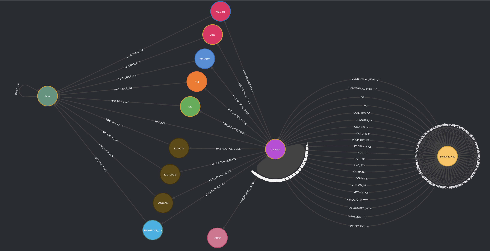
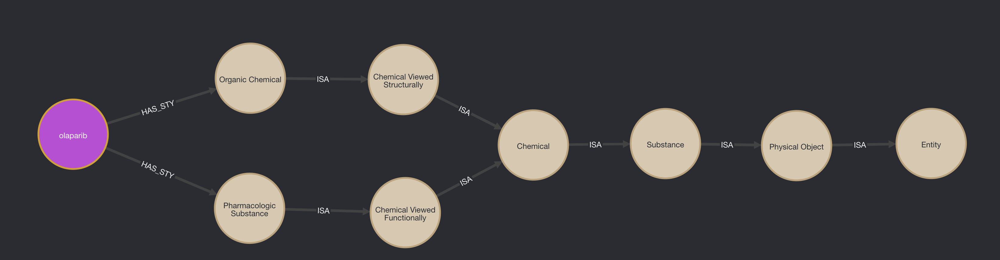
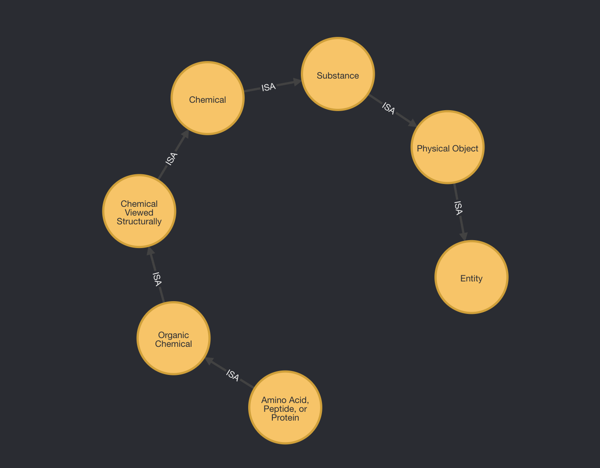
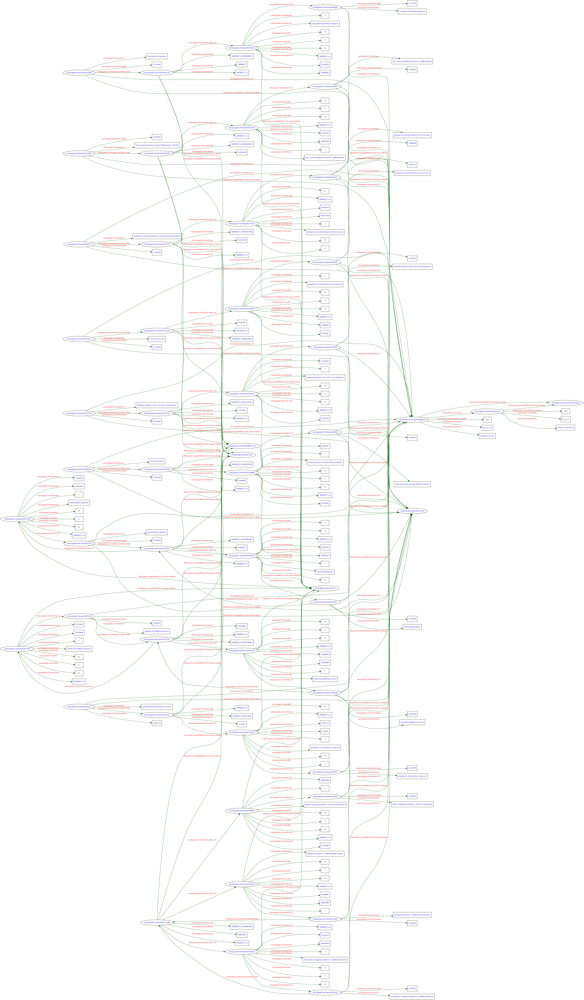

# Clinical Informatics UMLS®

**Summary:**

This repository will constitutes a multi-step ETL process with a strong analytical and data science component for a deep analytical dive into the Unified Medical Language System (UMLS®). UMLS's native .RRF files generated via MetamorphoSys will first be loaded into a RDBMS-based datastore.

Data transformation from the RDBMS of choice to a Neo4j Label Property Graph with the target schema found below (visual can be found in next section of README). If unfamiliar with Neo4j, check out all it has to offer -> [Neo4j](https://neo4j.com/).

Neo4j will serve as the primary datastore for both analysis of UMLS leveraging Neo4j's powerful tooling framework consisting of its native graph query language `Cypher` in conjunction with three powerful Neo4j product/plugin offerings - `APOC`, `Graph Data Science (GDS)` and `Neosemantics (N10s)`.

Usage of `APOC` and `Graph Data Science (GDS)` will provide powerful analytical approaches which extend Neo4j's un-matched ability to analyze, aggregate and visualize rich interconnected data. As the World's leading graph database - Neo4j provides industry leading performance, flexibility and versatility to analyze and make sense of such richly interconnected data. Neo4j's product offering `Neosemantics (N10s)` will be utilized as a means of mapping Neo4j LPG schema to a valid W3C RDF serialization & public schema. Furthermore mapping to the largest public schema in the world -> [schema.org](https://schema.org).

If unfamiliar with Neo4j product/plugin offerings  via `Neo4j Labs`, go check out the awesome documentation regarding the 3 plugins discussed above:

- [APOC](https://neo4j.com/labs/apoc/4.3/)
- [Graph Data Science (GDS)](https://neo4j.com/docs/graph-data-science/1.7/)
- [Neosemantics (N10s)](https://neo4j.com/labs/neosemantics/4.3/)

*__Disclaimer__*

While this repository is open to anyone & has been created to share knowledge, educate & contribute to the open source community, in order to access the source data from UMLS, you must be a UMLS® License Holder. Please visit [How to License and Access the Unified Medical Language System® (UMLS®) Data](https://www.nlm.nih.gov/databases/umls.html) to learn more. Its free! Just requires a personal application & approval.

Note: All functionalities mentioned above currently exist, function & are here to share. Watch this repo for updates, as they will be made over time. Repo is under construction and is not in its final form.

## Neo4j Schema Representation of UMLS



**Schema Overview:**

Note: The relationship `HAS_SOURCE_CODE` (`CUI` -> `CODE` relationship) shown in the schema can either be omitted or included per user preference.

There are 4 main elements (labels) within the graph which have been extracted from UMLS and transformed as a Neo4j Label Property Graph.

- The UMLS **atomic** unique identifier (`UMLS.MRCONSO.AUI` - `AUI`)
- The UMLS **concept** unique identifier (`UMLS.MRCONSO.CUI` - `CUI`)
- The UMLS **semantic** unique identifier (`UMLS.MRCONSO.TUI` - `TUI`)
- The **source vocabulary** concept unique identifier (`UMLS.MRCONSO.CODE` - `CODE`)
  - Source vocabularies within UMLS which are demonstrated within this v1 graph can be found in the schema illustration above. I.e. `NCI Thesaurus (NCI)`, `SNOMEDCT_US`, `ICDO3`, `ICD10CM`, `RXNORM`, `ATC`, `GO`, etc...

- The entire UMLS semantic network has been integrated into the graph via directed relationships to and from all semantic types within UMLS's semantic network.
  - Note: The RDBMS -> Neo4j transformation is achieved through running the following python script (relative directory) -> `clinical_informatics_umls/nodes_edges_part1.py`. This script can either be ran as is or can be configured many ways to omit or include particular vocabularies and/or relationships.

  - The semantic network is then related to the actual "concepts" contained in UMLS (i.e. `CUI (umlsCui)`, `AUI (umlsAui)` etc...) via the directed relationship `HAS_STY`. Refer to the following cypher query provided below as an example of how the semantic network relates to the actual "concepts" contained in the graph.

      ```Cypher
      // CUI = "C2316164" -> Concept Unique Identifier (umls_cui) for the concept "olaparib". 
      // We can see Olaparib is a Pharmacologic Substance & Organic Chemical. 
      // Furthermore, we can leverage UMLS's semantic network (ISA relationship) to visualize path to the root SemanticType(TUI).

      MATCH path = (concept:CUI)-[:HAS_STY]->(semanticType:TUI)-[:ISA*]->(semanticTypeParent:TUI) 
      WHERE concept.CUI = "C2316164"
      RETURN path
      ```



- Another related example to the above example (but exclusive to only the semantic network) is as follows:
  
- Another related example to the above example (but exclusive to only the semantic network) is as follows -> check out cypher & visualization to how the semantic network constitutes its own linked graph structure as a stand-alone part of the entire graph.
  - The query illustrates the shortest path (amongst `ISA` relations only) between the descendant `SemanticType - (TUI)` -> `Amino Acid, Peptide, or Protein` and the "topConceptOf" OR "root" `SemanticType - (TUI)` -> `Entity - (STY)`. See below:
  
      ```Cypher
      MATCH path = (to:TUI)<-[:ISA*]-(from:TUI) 
      WHERE to.STY = "Entity" 
      AND from.STY = "Amino Acid, Peptide, or Protein" 
      RETURN path
      ```



## UMLS Semantic Network

Below is the exact semantic network provided by [UMLS® Semantic Network Reference](https://uts.nlm.nih.gov/semanticnetwork.html) that has been modeled in this Neo4j LPG and briefly illustrated above.


- All `ISA` and `NON-ISA` relations seen in image above exist within this Neo4j schema of UMLS.

  - A noteworthy disclaimer provided by NIH is that the semantic relationships within the semantic network may or may not may hold true at the concept point of view AND/OR perspective.
    - For example, the relationship `Clinical Drug` `causes` `Disease or Syndrome` does not hold at the concept level for `Aspirin` and `Cancer`. (Aspirin does not cause Cancer)
      - This is anticipated, as within the semantic network produced by UMLS, Clinical Drug(s) are related to Diseases and Syndromes via multiple relationships (one of those being `causes`).
        - When this specific relationship is examined at the concept level, it can be assumed aspirin does not cause cancer. This is not to be a problem or cause confusion. Rather, the semantic network's ability to interrelate all concepts within the UMLS under 127 'broad' semantic types provides a useful means for labeling, categorizing AND/OR creating subgraphs of concepts based on semantic criteria.
          - The semantic network should only help navigate the graph of concepts and not for explicit relationship creation of between concepts.

## (In Progress) - Neo4j Schema Mapped to RDF - The W3C Standard Model for Data Interchange on the Web

- An on-going additional objective is to be able to appropriately map this Neo4j UMLS Graph (label property graph) to the W3C standard model for data interchange on the web - RDF (Resource Description Framework)

  - Here is a sample (very small sample) of a v0 W3C validated RDF representation of this Neo4j Graph of UMLS created in this repository.
    - You can find the .rdf file here:
      - [neo4j_umls_graph_to_rdf_sample.rdf](./output_data/v0_neo4j_umls_graph_mapped_to_rdf_sample.rdf)
    - The validation was performed via [W3C RDF Validation](https://www.w3.org/RDF/Validator/), in addition to the .png representing the graph as RDF.
  

`

- Additional W3C valid RDF serializations exposing small portions of the graph can be found within the following directory -> `output_data`.
  - While all are valid RDF serializations, work still needs to be done to appropriately map this Neo4j graph to schema.org.  

## Unified Medical Language System® (UMLS®) & Interoperability

In this repository, an exploration of a handful of the largest and/or industry relevant biomedical ontologies and terminologies  (within the Unified Medical Language System® (UMLS®)).

**Disclaimer** - while this repository is open to anyone & has been created to share knowledge, educate & provide to open source community. In order to access the data covered, you must be a UMLS® license holder. Please visit [How to License and Access the Unified Medical Language System® (UMLS®) Data](https://www.nlm.nih.gov/databases/umls.html) to learn more.

The scope of material covered in this repository will pertain specifically to healthcare, biotechnology & pharmaceutics. Largely in regards to oncology.
The terminologies and ontologies used in this repository available have been limited due to the enormous size of UMLS® (UMLS 2021AB containing >200+ terminologies constituting roughly a ~50-60GB MySQL database).

- Due to the shear size of UMLS the scope has been limited to appropriately 1/3 to 1/4 of entirety of UMLS to uplift inevitable resource constraints and enable local development.
  - Despite the "limited" scope, the vocabularies chosen to be included all live at the forefront of bringing interoperability to healthcare (scope mostly being disease, genetics & pharmaceutics). The terminologies covered have been chosen based on their utility and the strong relations that exist among them.
    - i.e. the terminologies SNOMEDCT_US, ICD9CM, ICD10CM, ICDO3, NCI, RXNORM, ATC all strongly relate to each other and depend on each other in ways in which they promote interoperability within healthcare.
      - In addition, these terminologies contain among the richest concept hierarchies (parent/child/ancestor/descendant relationships) and semantic relationships (such as SNOMEDCT_US, NCI, GO, RXNORM, ATC).

## What is the UMLS® & Why is it Important?

- "The UMLS® integrates and distributes key terminology, classification and coding standards, and associated resources to promote creation of more effective and interoperable biomedical information systems and services, including electronic health records."
  - [UMLS®](https://www.nlm.nih.gov/research/umls/index.html)

- The UMLS®, or Unified Medical Language System®, is a set of files and software that brings together many health and biomedical vocabularies and standards to enable interoperability between computer systems.
  - [UMLS®](https://www.nlm.nih.gov/research/umls/index.html)

- UMLS® contains over 200+ industry standard biomedical vocabularies & ontologies. Check out contents (ontologies/vocabularies) contained within UMLS® via following link:
  - [UMLS® Release Ontologies & Vocabularies](https://www.nlm.nih.gov/research/umls/sourcereleasedocs/index.html)

## Terminologies within Scope of Repository (list subject to change)

- **Anatomical Therapeutic Chemical Classification System:**
  - Abbreviation -> **ATC**
    - NIH/UMLS Vocabulary Documentation:
      - [ATC (Anatomical Therapeutic Chemical Classification System) - Synopsis](https://www.nlm.nih.gov/research/umls/sourcereleasedocs/current/ATC/index.html)
- **Gene Ontology:**
  - Abbreviation -> **GO**
    - NIH/UMLS Vocabulary Documentation:
      - [GO (Gene Ontology) - Synopsis](https://www.nlm.nih.gov/research/umls/sourcereleasedocs/current/GO/index.html)
- **HUGO Gene Nomenclature Committee:**
  - Abbreviation -> **HGNC**
    - NIH/UMLS Vocabulary Documentation:
      - [HGNC (HUGO Gene Nomenclature Committee) - Synopsis](https://www.nlm.nih.gov/research/umls/sourcereleasedocs/current/HGNC/index.html)
- **Human Phenotype Ontology:**
  - Abbreviation -> **HPO**
    - NIH/UMLS Vocabulary Documentation:
      - [HPO (Human Phenotype Ontology) - Synopsis](https://www.nlm.nih.gov/research/umls/sourcereleasedocs/current/HPO/index.html)
- **International Classification of Diseases, Ninth Revision, Clinical Modification:**
  - Abbreviation -> **ICD9CM**
    - NIH/UMLS Vocabulary Documentation:
      - [ICD9CM (International Classification of Diseases, Ninth Revision, Clinical Modification) - Synopsis](https://www.nlm.nih.gov/research/umls/sourcereleasedocs/current/ICD9CM/index.html)
- **International Classification of Diseases, Tenth Revision, Clinical Modification:**
  - Abbreviation -> **ICD10CM**
    - NIH/UMLS Vocabulary Documentation:
      - [ICD10CM (International Classification of Diseases, Tenth Revision, Clinical Modification) - Synopsis](https://www.nlm.nih.gov/research/umls/sourcereleasedocs/current/ICD10CM/index.html)
- **ICD-10 Procedure Coding System:**
  - Abbreviation -> **ICD10PCS**
    - NIH/UMLS Vocabulary Documentation:
      - [ICD10PCS (ICD-10 Procedure Coding System) - Synopsis](https://www.nlm.nih.gov/research/umls/sourcereleasedocs/current/ICD10PCS/index.html)
- **LOINC:**
  - Abbreviation -> **LNC**
    - NIH/UMLS Vocabulary Documentation:
      - [LNC (LOINC) - Synopsis](https://www.nlm.nih.gov/research/umls/sourcereleasedocs/current/LNC/index.html)
- **MedDRA:**
  - Abbreviation -> **MDR**
    - NIH/UMLS Vocabulary Documentation:
      - [MDR (MedDRA) - Synopsis](https://www.nlm.nih.gov/research/umls/sourcereleasedocs/current/MDR/index.html)
- **Medication Reference Terminology:**
  - Abbreviation -> **MED-RT**
    - NIH/UMLS Vocabulary Documentation:
      - [MED-RT (Medication Reference Terminology) - Synopsis](https://www.nlm.nih.gov/research/umls/sourcereleasedocs/current/MED-RT/index.html)
- **MeSH:**
  - Abbreviation -> **MSH**
    - NIH/UMLS Vocabulary Documentation:
      - [MSH (MeSH) - Synopsis](https://www.nlm.nih.gov/research/umls/sourcereleasedocs/current/MSH/index.html)
- **NCBI Taxonomy:**
  - Abbreviation -> **NCBI**
    - NIH/UMLS Vocabulary Documentation:
      - [NCBI (NCBI Taxonomy) - Synopsis](https://www.nlm.nih.gov/research/umls/sourcereleasedocs/current/NCBI/index.html)
- **National Cancer Institute Thesaurus:**
  - Abbreviation -> **NCI**
    - NIH/UMLS Vocabulary Documentation:
      - [NCI (NCI Thesaurus) - Synopsis](https://www.nlm.nih.gov/research/umls/sourcereleasedocs/current/NCI/index.html)
- **Physician Data Query:**
  - Abbreviation -> **PDQ**
    - NIH/UMLS Vocabulary Documentation:
      - [PDQ (Physician Data Query) - Synopsis](https://www.nlm.nih.gov/research/umls/sourcereleasedocs/current/PDQ/index.html)
- **RXNORM:**
  - Abbreviation -> **RXNORM**
    - NIH/UMLS Vocabulary Documentation:
      - [RXNORM (RXNORM) - Synopsis](https://www.nlm.nih.gov/research/umls/sourcereleasedocs/current/RXNORM/index.html)
- **SNOMED CT, US Edition:**
  - Abbreviation -> **SNOMEDCT_US**
    - NIH/UMLS Vocabulary Documentation:
      - [SNOMEDCT_US (SNOMED CT, US Edition) - Synopsis](https://www.nlm.nih.gov/research/umls/sourcereleasedocs/current/SNOMEDCT_US/index.html)
- **Source Terminology Names (UMLS):**
  - Abbreviation -> **SRC**
    - NIH/UMLS Vocabulary Documentation:
      - [SRC (Source Terminology Names (UMLS)) - Synopsis](https://www.nlm.nih.gov/research/umls/sourcereleasedocs/current/SRC/index.html)

## Python Environment Setup

Strongly recommend use of [pyenv](https://github.com/pyenv/pyenv) to enable easy switches between multiple versions of Python.

- Python >=3.8,<3.11 required based on `pyproject.toml`

- [Pyenv](https://github.com/pyenv/pyenv) & python packing packing and dependency management via [Poetry](https://python-poetry.org/) have been implemented for python versioning and dependency management.
  - If unfamiliar with [Pyenv](https://github.com/pyenv/pyenv) AND/OR [Poetry](https://python-poetry.org/), please check out their respective official docs.

This project has included `pyproject.toml` and `poetry.lock` files as the python packaging and dependency management.

- Execute following command to create a virtual environment within project's root directory:
  - `python -m venv .venv`
  - `source .venv/bin/activate`
    - This will create a venv (`.venv`) located at root directory of repository -> `.venv`.

  - Install all python packaging/dependencies into the venv via:
    - `poetry install`
      - This will install all packaging requirements/dependencies.
        - Visit [Poetry](https://python-poetry.org/) and follow instructions for using `Poetry Installer`.
          - Example way of using Poetry using a venv would look like this:
            - 1). install Poetry via `curl -sSL https://raw.githubusercontent.com/python-poetry/poetry/master/get-poetry.py | python -` **(OSX/LINUX)**
            - 2). `python -m venv .venv`
            - 3). `source .venv/bin/activate`
            - 4). `poetry install`
            - 5). Good to go! (All `{}`)

## Getting started

- After running UMLS metamorphoSys (have source files) and your python environment has been setup. Navigate to relative directory `cd clinical_informatics_umls` & run the python script `create_sqlite_db.py`:
  - `poetry run python create_sqlite_db.py` -> This will create a sqlite3 database containing all required tables, indexes and constraints required to create our Neo4j Graph.
    - The script will create `umls_py.db` within the relative directory `.../sqlite`.
      - This will only take ~5 min to run & will look similiar to following:

      ```SHELL
      clinical_informatics_umls % poetry run python create_sqlite_db.py
      creating umls_py.db
      opening files
      Creating tables
      Inserting data into MRSTY table
      Inserting data into MRCONSO table
      Inserting data into MRREL table
      Inserting data into MRHIER table
      Inserting data into MRRANK table
      Inserting data into SRDEF table
      Inserting data into SRSTR table
      Inserting data into SRSTRE1 table
      Inserting data into SRSTRE2 table
      Inserting data into MRSAB table
      Creating indices
      SQLite database created - umls_py.db
      ```

    - If you want to use MySQL, Mariadb or PostgresSQL then refer to the load scripts made available in `databases/mysql/` & `databases/postgres/`
- Once you have loaded a RDBMS with your UMLS 2021AB subset, create a an directory called `import` (at your home directory) - This directory needs to contain all the files that will be loaded into Neo4j.
- This directory will be mounted outside the container to leverage using `neo4j-admin import` tool. (Required for imports of >10 million nodes & takes only a minute or two).
- Once you have created the directory (i.e. `$HOME/import`) navigate back to the following directory `clinical_informatics_umls/clinical_informatics_umls`.
  - Now we will execute another python script to generate 11 .csv files that constitute 4 node files and 7 relationship files.
    - The script will write out to all correctly formatted .csv files for import at the following -> `$HOME/import`.
      - `poetry run python nodes_edges_part1.py`
      - Upon the completion of the scripts execution we are ready to proceed with steps that follow `Neo4j Docker Setup & Data Import`.
        - Make sure you have docker installed & take a look over the docker run command.

## Neo4j Docker Setup & Data Import

Docker Image:

```shell
docker run -it --name=<insert container name> \
    -p7474:7474 -p7687:7687 \
    -d \
    --volume=$HOME/neo4j/data:/data \
    --volume=$HOME/neo4j/logs:/logs \
    --volume=$HOME/import:/var/lib/neo4j/import \
    --volume=$HOME/neo4j/plugins:/plugins \
    --volume=$HOME/neo4j/backups:/backups \
    --volume=$HOME/neo4j/data/rdf:/data/rdf \
    --env=NEO4J_ACCEPT_LICENSE_AGREEMENT=yes \
    --env=NEO4J_dbms_backup_enabled=true \
    --env=NEO4J_apoc_export_file_enabled=true \
    --env=NEO4J_apoc_import_file_enabled=true \
    --env=NEO4J_apoc_import_file_use__neo4j__config=true \
    --env=NEO4J_apoc_export_file_use__neo4j__config=true \
    --env=NEO4JLABS_PLUGINS='["apoc", "graph-data-science", "n10s"]' \
    --env=NEO4J_dbms_memory_heap_initial_tx_state_memory__allocation=ON_HEAP \
    --env=NEO4J__dbms_jvm_additional=-Dunsupported.dbms.udc.source=debian \
    --env=NEO4J_AUTH=neo4j/<insert pwd> \
    --env=NEO4J_dbms_unmanaged__extension__classes=n10s.endpoint=/rdf \
    neo4j:4.3.4-enterprise
```

## Import Data Into Neo4j Graph

- Importing the .csv files will require use of Neo4j's `neo4j-admin import` tool

  - Required for imports > 10 million nodes/edges

- Execute the following commands within your terminal:

  - `docker exec -it <CONTAINER ID> /bin/bash`

    - Your terminal should appear as follows:

      - `root@<CONTAINER ID>:/var/lib/neo4j#`

      - The character string following `root@` should be the Docker `CONTAINER ID`.

      - This is where we can invoke `neo4j-admin import`.

- Ensure you have correctly mounted volumes appropriately & the `import` directory is not not located within the directory `neo4j`.

- **While inside docker containers command-line, execute the following prior to import:**
  - `rm -rf data/databases/`
  - `rm -rf data/transactions/`
  - Please be aware that is best to execute above two commands twice prior to running `neo4j-admin import`
- **NOTE:** This is a required step when using `neo4j-admin import`.
  - By invoking this command to import data, the database for your data must not already exist as well.

- Now the database can be created & imported into. Execute the following:

```SHELL
    ./bin/neo4j-admin import \
    --database=neo4j \
    --nodes='import/semanticTypeNode.csv' \
    --nodes='import/conceptNode.csv' \
    --nodes='import/atomNode.csv' \
    --nodes='import/codeNode.csv' \
    --relationships='import/has_sty_rel.csv' \
    --relationships='import/has_aui_rel.csv' \
    --relationships='import/has_cui_rel.csv' \
    --relationships='import/tui_tui_rel.csv' \
    --relationships='import/concept_concept_rel.csv' \
    --relationships='import/child_of_rel.csv' \
    --relationships='import/cui_code_rel.csv' \
    --skip-bad-relationships=true \
    --skip-duplicate-nodes=true \
    --trim-strings=true
```

Here are a few snippets of what the above commands should look like (including both inputs & outputs):

```SHELL
% docker exec -it <CONTAINER ID> /bin/bash
/var/lib/neo4j# rm -rf data/databases/
/var/lib/neo4j# rm -rf data/transactions/
/var/lib/neo4j# ./bin/neo4j-admin import \
    --database=neo4j \
    --nodes='import/semanticTypeNode.csv' \
    --nodes='import/conceptNode.csv' \
    --nodes='import/atomNode.csv' \
    --nodes='import/codeNode.csv' \
    --relationships='import/has_sty_rel.csv' \
    --relationships='import/has_aui_rel.csv' \
    --relationships='import/has_cui_rel.csv' \
    --relationships='import/tui_tui_rel.csv' \
    --relationships='import/concept_concept_rel.csv' \
    --relationships='import/child_of_rel.csv' \
    --relationships='import/cui_code_rel.csv' \
    --skip-bad-relationships=true \
    --skip-duplicate-nodes=true \
    --trim-strings=true

Output:


Importing the contents of these files into /var/lib/neo4j/data/databases/neo4j:
Nodes:
  /var/lib/neo4j/import/semanticTypeNode.csv
  /var/lib/neo4j/import/conceptNode.csv
  /var/lib/neo4j/import/atomNode.csv
  /var/lib/neo4j/import/codeNode.csv

Relationships:
  /var/lib/neo4j/import/has_sty.csv
  /var/lib/neo4j/import/has_aui_rel.csv
  /var/lib/neo4j/import/has_cui_rel.csv
  /var/lib/neo4j/import/tui_tui_rel.csv
  /var/lib/neo4j/import/concept_concept_rel.csv
  /var/lib/neo4j/import/child_of_rel.csv
  /var/lib/neo4j/import/cui_code_rel.csv
  ...

  Estimated number of nodes: 17.01 M
  Estimated number of node properties: 66.68 M
  Estimated number of relationships: 49.20 M
  Estimated number of relationship properties: 18.33 M
  Estimated disk space usage: 4.408GiB
  Estimated required memory usage: 880.4MiB

(1/4) Nodes import
  ...
(2/4) Relationship import
  ...
(3/4) Relationship linking
  ...
(4/4) Post processing
  ...
Imported:
  16838348 nodes
  42934606 relationships
  79579572 properties
```

Exit docker command-line via:

- `exit`

Need to restart the container:

- `docker restart <CONTAINER ID>`

- Once container has been restarted (s/p successful import), go ahead and Navigate to [Neo4j Browser](http://localhost:7474/) within a browser & login using the credentials set via the environmental variable `env=NEO4J_AUTH=neo4j/<password>`.
  - user: `neo4j` (default is `neo4j` -> set in `--env=NEO4J_AUTH=neo4j/<password>`)
  - pass: `<password>` -> set prior via `--env=NEO4J_AUTH=neo4j/<password>`)

## Querying the UMLS as a Neo4j Graph

Checkout the notebooks directory where the graph will be queried via both official `neo4j` python driver & community supported python driver `py2neo`.
