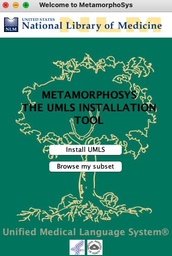
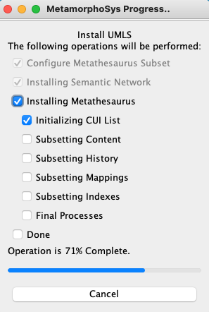

# MetamorphoSys - The UMLS Installation and Customization Program

MetamorphoSys is the UMLS installation wizard and Metathesaurus customization tool included in each UMLS release. It installs one or more of the UMLS Knowledge Sources. When the Metathesaurus is selected, it enables you to create customized Metathesaurus subsets. Please use only the version of MetamorphoSys distributed with the release

Users customize their Metathesaurus subsets for two main purposes:

1. To exclude vocabularies from output that are not required or licensed for use in a local application.
The Metathesaurus consists of a number of files, some of which are extremely large; excluding sources can significantly reduce the size of the output subset. Given the number and variety of vocabularies reflected in the Metathesaurus, it is unlikely that any user would require all, or even most, of its more than 100 vocabularies. In addition, some sources require separate license agreements for specific uses, which a UMLS user may not wish to obtain. These are clearly indicated in the [License Agreement][def5].

2. To customize a subset using a variety of data output options and filters.

To identify vocabularies that may not be needed in a customized subset, read the [License Agreement][def5], and refer to [UMLS Source Vocabulary Documentation page][def4] of the current UMLS release documentation.

The [RRF Browser][def3], which allows users to find a term within a customized Metathesaurus subset or any vocabulary in the RRF format, is also included in MetamorphoSys.

There are no license restrictions on the MetamorphoSys code. We hope that users will acknowledge the NLM source, in the spirit of the [GNU Public License (GPL)][def2].

Please visit [MetamorphoSys - The UMLS Installation and Customization Program][def] to follow along to run MetamorphoSys and create a subset of data from the UMLS.

## TLDR; MetamorphoSys

1. run `clinical_informatics_umls/umls_downloader.py` to download latest full release of the UMLS.
2. This is a large .zip file (>40GB) - once downloaded unzip the downloaded .zip and `mmsys.zip` and ensure root directory of 2022AB-full looks as follows:

Run `sh.run_mach.sh` or the appropriate .sh or .bat file depending if running Windows, MacOS etc. This will run the java program MetamorphoSys:

Unless you have a .prop configuration file you will need to Install UMLS. You will be prompted to select both input & output directories of UMLS files (this will be where you have the `2022AB-full` directory) and an output location of your choosing. For simplicity I recommend `./clinical_informatics_umls/UMLS/subset/` as this will ensure you don't have to change any path variables and will work as this codebase is setup.

Go ahead and check out helpful [Instructional UMLS Learning Resources]("https://www.nlm.nih.gov/research/umls/user_education/learning_resources.html") on how to work the program to create your UMLS subset.

Creating a configuration file and running the program is quite intuitive. If you have done everything correctly you will see something quite similar to below screanshot. I have same configurations at `../conf/` to reference or use.

I have provided sample configurations at `../conf/` to reference or use if you'd like to.

[def]: "https://www.ncbi.nlm.nih.gov/books/NBK9683/"
[def2]: "http://www.gnu.org/copyleft/gpl.html"
[def3]: "http://www.nlm.nih.gov/research/umls/implementation_resources/metamorphosys/RRF_Browser.html"
[def4]: "https://www.nlm.nih.gov/research/umls/sourcereleasedocs/index.html"
[def5]: "https://uts.nlm.nih.gov/license.html"
